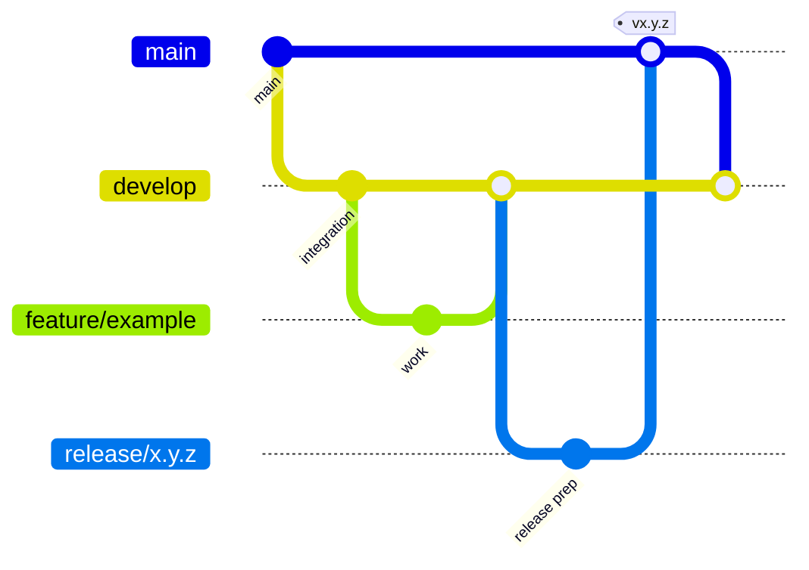

# Contributing

## Development model

This repository uses GitFlow.



Use:

- `main` for stable released states.
- `develop` for integrated development.
- `feature/<name>` for normal development.
- `fix/<name>` for non-release fixes.
- `release/<version>` for release preparation.
- `hotfix/<name>` for urgent fixes based on `main`.

## Local tests

The pure logic and integration-like tests can run without a FreeCAD installation.

```bash
python -m pip install pytest
python -m pytest -q
```

XLSX export uses `openpyxl` when available. The test suite handles this dependency as optional.

## Pull requests

Keep pull requests focused.

When a change affects FreeCAD-facing behavior, include:

- the affected workbench command
- the FreeCAD version used for manual validation
- the expected document or TechDraw behavior
- screenshots when the UI or drawing output changes

Update documentation when changing:

- metadata schema
- BOM output
- object identification
- TechDraw assumptions
- installation steps

## Commit style

Prefer concise conventional-style messages:

```text
feat: add revision metadata field
fix: preserve BOM item ordering
test: cover linked assembly objects
docs: document TechDraw adapter
```

## Design principle

Prefer adapters and small service boundaries over spreading FreeCAD API calls through the application.

FreeCAD APIs can vary by version, so runtime-specific assumptions should remain isolated and documented.
