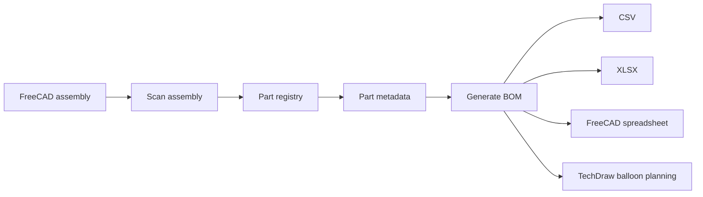
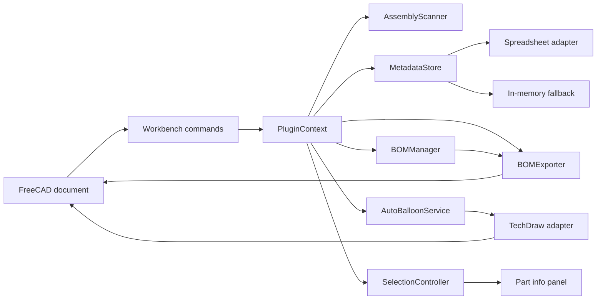
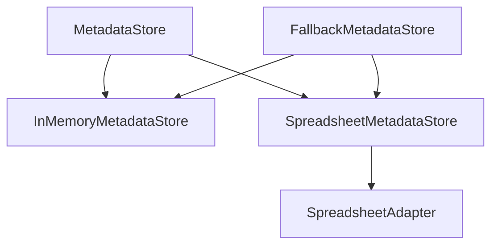

# FreeCAD Assembly Inspector

A modular FreeCAD workbench for assembly inspection, part metadata, BOM generation and TechDraw automation.


## Overview

FreeCAD Assembly Inspector helps inspect assembly content, attach metadata to parts, generate BOM data and create TechDraw balloon callouts.

The project is structured so that most application logic is testable without requiring a live FreeCAD session.

## Core workflow



## Features

- FreeCAD workbench registration
- Assembly scanning
- Normalized `PartRecord` registry
- Editable part metadata
- Spreadsheet-backed metadata persistence
- In-memory fallback metadata store
- Selection-driven part information panel
- BOM generation
- CSV export
- Optional XLSX export
- BOM persistence into a FreeCAD spreadsheet
- TechDraw balloon planning and best-effort creation
- Unit and integration-like tests using lightweight FreeCAD test doubles

## Architecture



See [docs/architecture.md](docs/architecture.md) for the component responsibilities and design decisions.

## Repository layout

```text
FreeCAD-Assembly-Inspector/
|-- .github/
|   `-- workflows/
|       `-- ci.yml
|-- assembly_inspector/
|   |-- commands/
|   |-- controllers/
|   |-- models/
|   |-- services/
|   |-- ui/
|   |-- freecad_compat.py
|   |-- plugin_context.py
|   `-- workbench.py
|-- docs/
|   `-- architecture.md
|-- tests/
|-- Init.py
|-- InitGui.py
|-- CHANGELOG.md
|-- CONTRIBUTING.md
|-- LICENSE
|-- pyproject.toml
`-- README.md
```

## How it works

1. Open an assembly document in FreeCAD.
2. Run `Scan Assembly`.
3. `AssemblyScanner` converts relevant document objects into `PartRecord` instances.
4. `PluginContext` binds the active document to the available metadata store.
5. Selecting a known part opens the editable metadata panel.
6. `Generate BOM` groups parts by part id and combines them with stored metadata.
7. The BOM can be written into the document spreadsheet or exported to CSV or XLSX.
8. `Auto Balloon` uses the generated BOM and TechDraw adapters to plan and attempt callout creation.

## Metadata strategy

Metadata persistence follows an adapter-based design.



When spreadsheet APIs are available, metadata is stored inside the FreeCAD document. If the primary store cannot be used, the application keeps an in-memory fallback.

## Installation

Copy the repository into the FreeCAD `Mod` directory:

```text
.../FreeCAD/Mod/FreeCAD-Assembly-Inspector
```

Restart FreeCAD and activate the `Assembly Inspector` workbench.

## Tests

Most service and orchestration logic is tested outside FreeCAD using lightweight test doubles.

Run:

```bash
python -m pip install pytest openpyxl
python -m pytest -q
```

The suite covers:

- assembly scanning
- metadata stores
- spreadsheet schema behavior
- BOM generation
- CSV and XLSX export
- command integration using test doubles
- TechDraw balloon planning
- logging behavior

GitHub Actions runs the portable suite on Python 3.11 and 3.12.

## FreeCAD integration boundary

The automated tests validate the portable logic and simulated integrations.

Behavior that depends on the real FreeCAD runtime still requires manual validation, especially:

- workbench registration
- GUI behavior
- linked or recomputed assembly object behavior
- TechDraw geometry and callout creation
- compatibility across FreeCAD versions

This boundary is intentional and documented rather than hidden.

## Current status

The repository is an MVP-level workbench with working scan, metadata, BOM and export flows.

TechDraw auto-ballooning is implemented as a best-effort adapter-based workflow. It should be considered experimental until validated across more FreeCAD versions and assembly structures.

## Roadmap

Current next steps include:

- stable object identity across linked and recomputed assemblies
- configurable metadata schemas and validation
- stronger TechDraw anchor extraction
- richer BOM export controls
- real FreeCAD integration smoke tests across selected versions

## Contributing

See [CONTRIBUTING.md](CONTRIBUTING.md) for the GitFlow workflow and development guidelines.

## License

Released under the MIT License. See [LICENSE](LICENSE).
