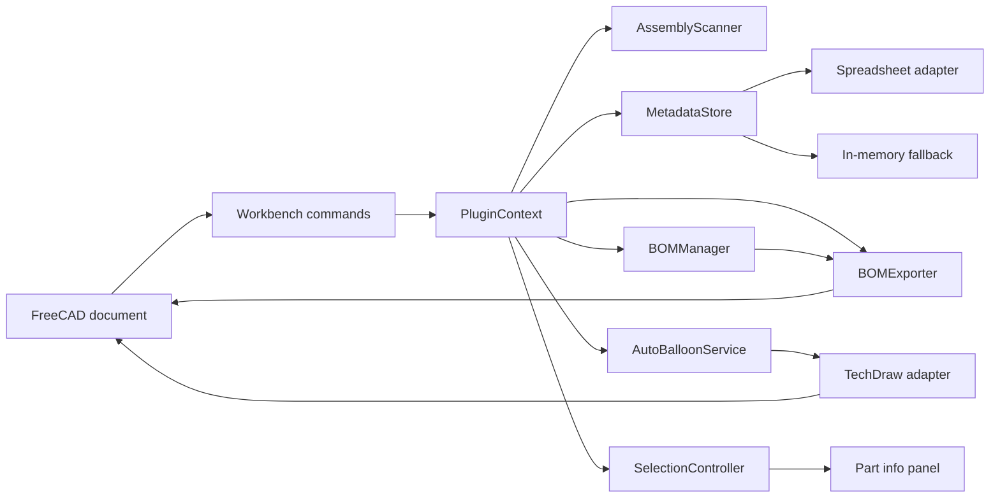
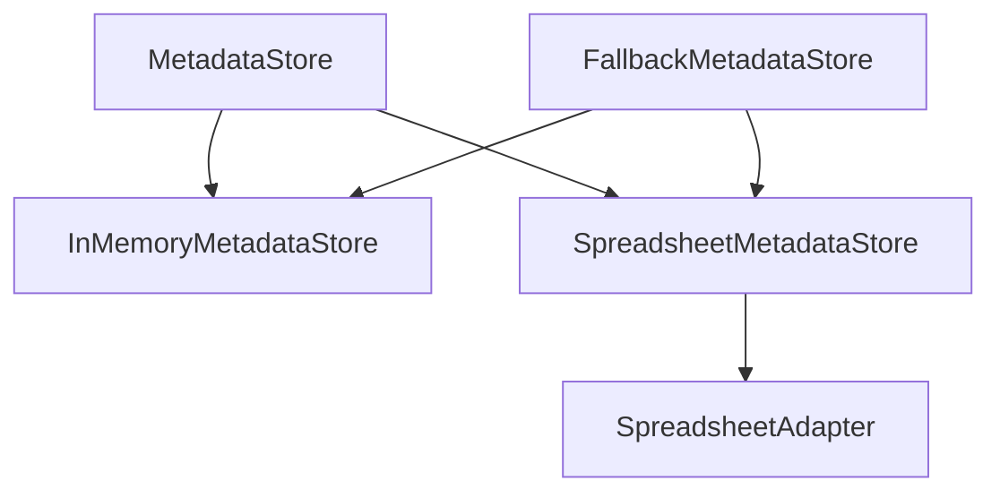
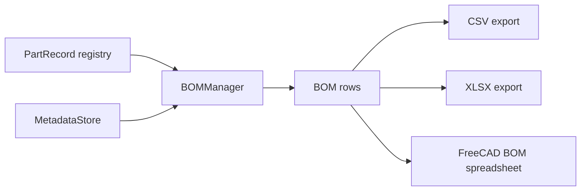

# Architecture

## Overview

FreeCAD Assembly Inspector is structured as a small workbench with a clear separation between FreeCAD runtime integration, application services and UI concerns.

## Main components

### Workbench and commands

`Init.py`, `InitGui.py` and `workbench.py` register the workbench and expose user actions.

Command modules stay thin and delegate behavior to `PluginContext`.

### PluginContext

`PluginContext` is the main orchestration layer. It coordinates:

- assembly scanning
- metadata persistence
- selection handling
- BOM generation
- BOM export
- TechDraw ballooning

It also owns the current part registry and document binding.

### Assembly scanning

`AssemblyScanner` inspects document objects and converts relevant objects into normalized `PartRecord` instances.

This allows the rest of the application to work against a stable internal model instead of depending directly on every FreeCAD object shape.

### Metadata storage

Metadata access is defined through the `MetadataStore` abstraction.

The spreadsheet-backed store persists metadata inside the FreeCAD document when the required spreadsheet API is available. The in-memory implementation acts as the fallback.

### BOM pipeline

`BOMManager` groups records by part id and produces normalized `BOMRow` objects.

`BOMExporter` handles output formatting and persistence.

### TechDraw integration

TechDraw-specific assumptions are isolated in `TechDrawAdapter` and `AutoBalloonService`.

The service performs two separate steps:

1. Plan balloon positions.
2. Apply the plan to the selected TechDraw page.

This separation makes the planning logic testable without a real FreeCAD session.

### Selection and UI

`SelectionController` observes FreeCAD selection changes and resolves selected objects against the current part registry.

The modeless part information panel displays and edits metadata through the active metadata store.

## FreeCAD boundary

Runtime-specific imports and behaviors are isolated as much as possible in:

- `freecad_compat.py`
- spreadsheet adapters
- TechDraw adapters
- command registration
- UI integration

This keeps most business logic testable with lightweight test doubles.

## Testing strategy

The current test suite uses fake FreeCAD-like objects for most service and command tests.

This provides fast validation for:

- assembly scanning
- metadata persistence
- spreadsheet schema behavior
- BOM generation
- BOM export
- command activation
- balloon planning

Real FreeCAD integration testing remains a future layer because API behavior can vary across FreeCAD versions.
